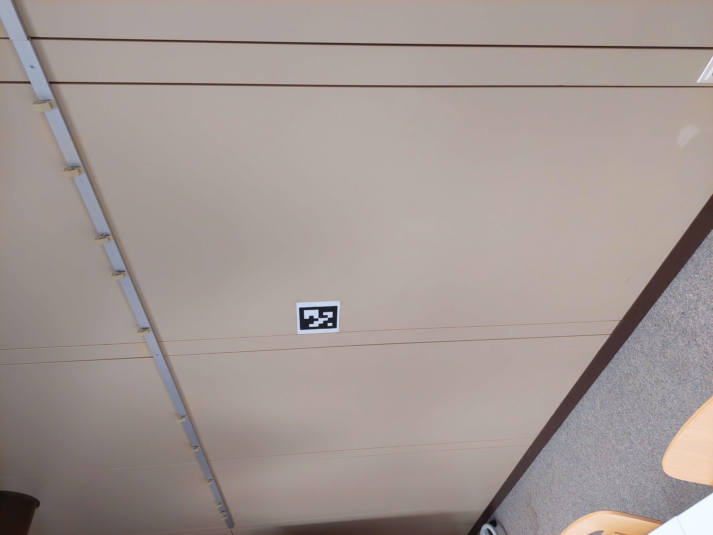
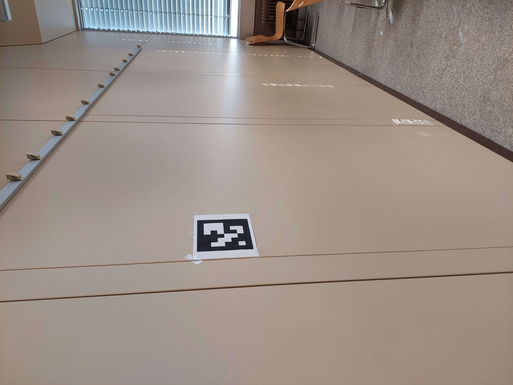
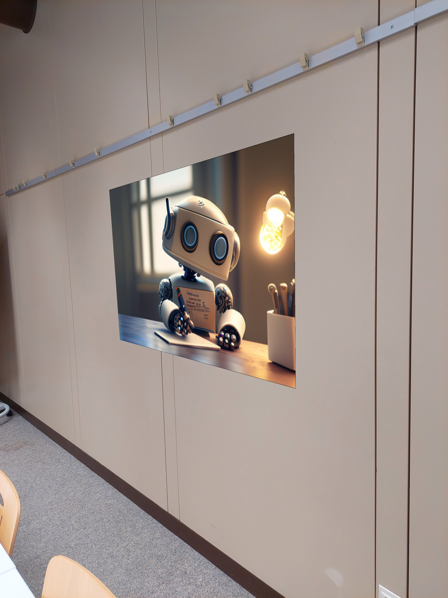
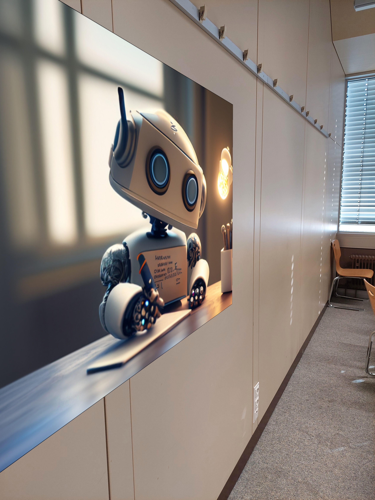
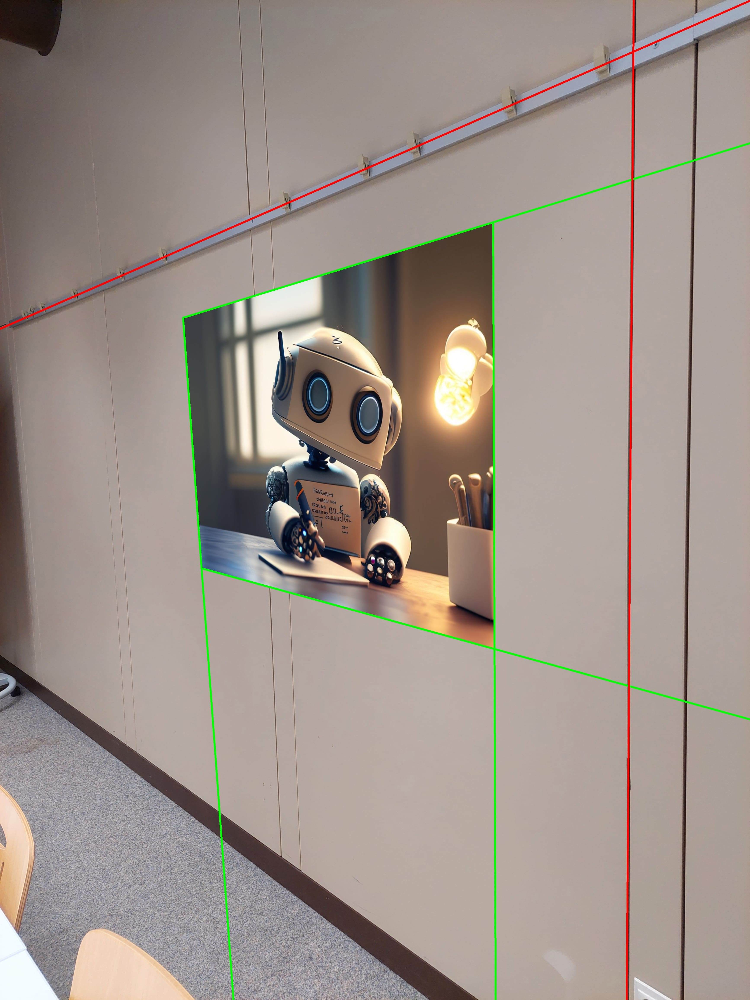
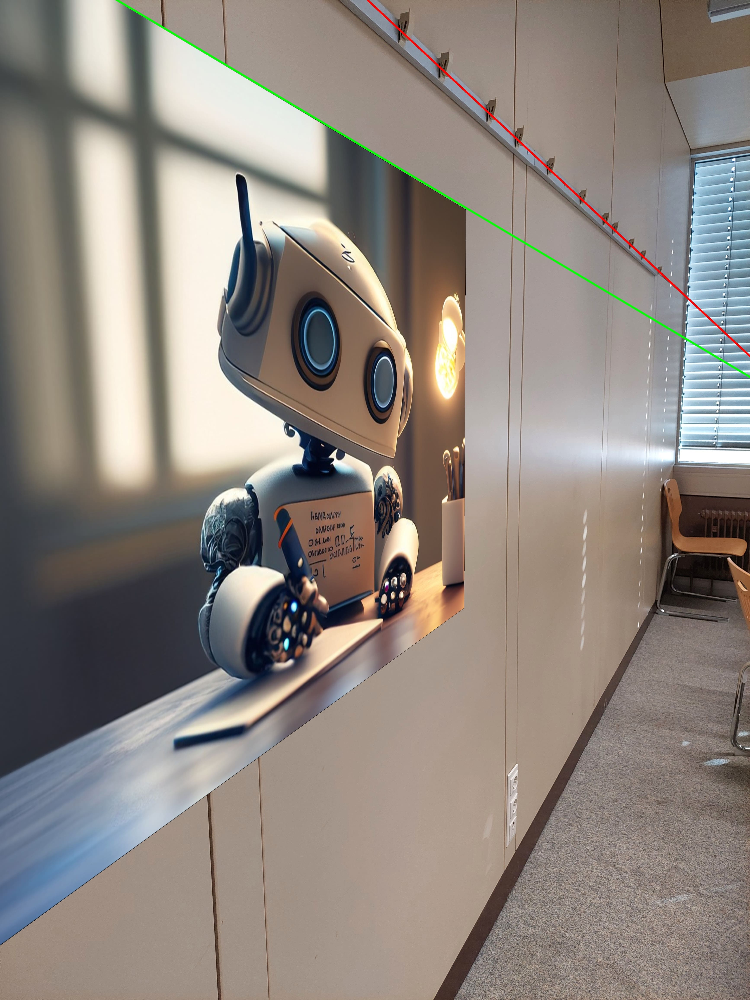

# Project Details: Augmented Reality with ArUco Markers

## Introduction

This project demonstrates how to overlay images (such as posters) onto real-world scenes using ArUco markers and computer vision techniques. The implementation utilizes the OpenCV library for marker detection and image processing, resulting in an augmented reality (AR) experience where posters are accurately placed in 3D space and projected onto 2D images.

## Project Structure

The project repository contains the following components:

- **`main.ipynb`**: The primary Python Jupyter notebook containing the code for ArUco marker detection, perspective transformations, and poster overlay.
- **`room_with_aruco_marker/`**: Folder containing images of the room setup with ArUco markers.
- **`aruco_markers_detection/`**: Folder containing images after detecting ArUco markers.
- **`poster_overlayed/`**: Folder containing images with posters overlaid onto the detected ArUco markers.
- **`evaluation/`**: Folder containing evaluation images of the overlaid posters and the corresponding analysis.

## Dependencies

This project requires the following Python libraries:

- OpenCV (`opencv-python`)
- NumPy
- Matplotlib

Install these libraries using pip:

```bash
pip install opencv-python numpy matplotlib
```

## Usage

1. Clone the repository to your local machine.
2. Open the **`main.ipynb`** file in a Jupyter Notebook environment.
3. Run the notebook cells sequentially to detect ArUco markers, and overlay posters.

## Image Reference

This image is used in project as a poster to overlay on the ArUco marker.


The poster image used in this project is sourced from [this link](https://www.einfach-wilke.de/ki-texte-schreiben/) accessed on 25 April 2024.

## Example Output

Below are a few example images showing the result of overlaying the poster onto ArUco markers:

- Image 1: ArUco Marker Detection

<div style="display: flex; justify-content: space-around;">
  
  
</div>

- Image 2: Poster Overlayed on ArUco Marker

<div style="display: flex; justify-content: space-around;">
    
    
</div>

- Image 3: Evaluation of the Poster Placement

<div style="display: flex; justify-content: space-around;">
    
    
</div>

## Conclusion

The project successfully demonstrates the use of ArUco markers and computer vision techniques to create an augmented reality experience. The approach provides an efficient method for placing virtual content in the real world, with accurate detection and placement of posters on walls based on the position and orientation of the markers.

## Acknowledgments

- The dataset of the room with ArUco markers was provided by Prof. Dr. Stefan Elser as part of the Master's course.
- Poster image used in the project sourced from [this link](https://www.einfach-wilke.de/ki-texte-schreiben/) accessed on 25 April 2024.