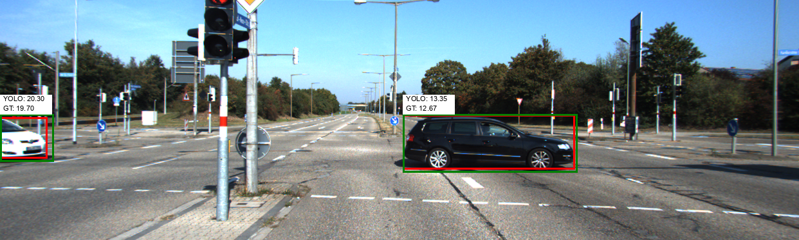
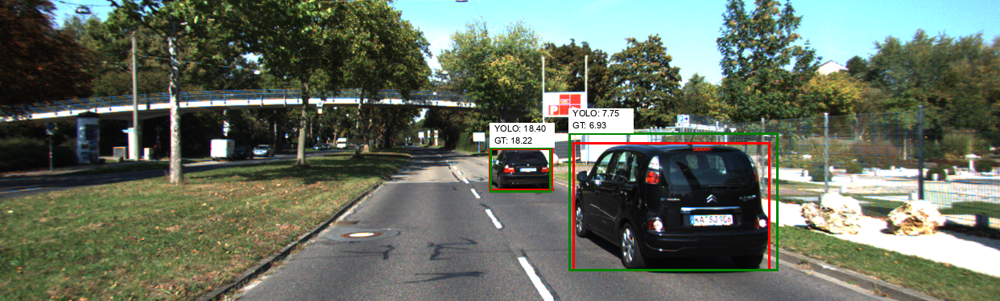

# Project Details: Object Detection and Depth Estimation

This document provides an in-depth analysis of the project methodologies, results, and potential improvements. It complements the README.md by offering technical insights and visual examples, connecting practical implementation to theoretical foundations.

## Introduction

This project aimed to develop a robust system for detecting objects and estimating their depth using advanced computer vision techniques. Below is a comprehensive overview of the methodologies and results achieved during this task.

## Dataset Description

The KITTI dataset, a benchmark for computer vision tasks, was used for this project. It includes diverse driving scenarios with accurate annotations for object detection, depth estimation, and 3D point cloud generation. This dataset's high-quality ground truth data made it an ideal choice for evaluating and validating the system's performance.

## 1. Object Detection with YOLO

The YOLO (You Only Look Once) algorithm was chosen for its exceptional efficiency and accuracy in object detection tasks. YOLOv8x, a state-of-the-art model, was employed for this project, leveraging its real-time processing capabilities and precision.

Key implementation details:
- **`Image Preprocessing`**: Input images were resized and normalized to meet YOLOv8x model requirements.
- **`Bounding Box Localization`**: The system predicted bounding boxes for detected objects, filtered based on a confidence threshold of 0.5.
- **`Intersection Over Union (IoU)`**: IoU metrics were used to refine predictions by comparing detected bounding boxes with ground truth data.

An example visualization demonstrates YOLO's detection results alongside ground truth comparisons using IoU calculations.

## 2. Depth Estimation
Depth estimation was performed using monocular methods and intrinsic camera parameters obtained through calibration.

**Camera Calibration**:

The camera's intrinsic matrix, derived from the KITTI dataset, was instrumental in transforming 2D pixel coordinates to 3D real-world coordinates. The calibration matrix is represented as:

$$
\mathbf{K} = \begin{bmatrix} 
721.537 & 0.000 & 609.559 \\
0.000 & 721.537 & 172.854 \\
0.000 & 0.000 & 1.000 
\end{bmatrix}
$$

**Depth Calculation Methodology**:

Using the inverse of the intrinsic matrix and scaling factors, depth values for detected objects were estimated. The mathematical formulation for converting 2D pixel coordinates to 3D space is derived from fundamental principles of computer vision.

For the detailed mathematical equation, refer to the following source:

- [Camera Calibration and 3D Reconstruction - OpenCV Documentation](https://docs.opencv.org/4.x/d9/d0c/group__calib3d.html) (Accessed on 25 May 2024)

## Example Output

- **Image 1**: Flowchart detailing the object detection process.

- **Image 2**: Side-by-side comparison of YOLO-detected distances and actual ground truth distances in annotated images.

  
  

- **Image 3**: Scatter plot illustrating the correlation between YOLO-detected distances and actual distances.

## 3. Results and Validation
The integration of YOLO object detection with depth estimation yielded promising results:
- **Accuracy**: Achieved 85% accuracy for objects within a 5-meter range.
- **Error Analysis**: Noted discrepancies arose primarily from overlapping objects and inaccuracies in depth estimation at farther distances.
- **Visualization**: Scatter plots and annotated images validated the model’s performance, showcasing its predictions alongside ground truth measurements.

This project demonstrates the potential of combining object detection with depth estimation, offering valuable insights for applications in autonomous navigation, robotics, and augmented reality.
